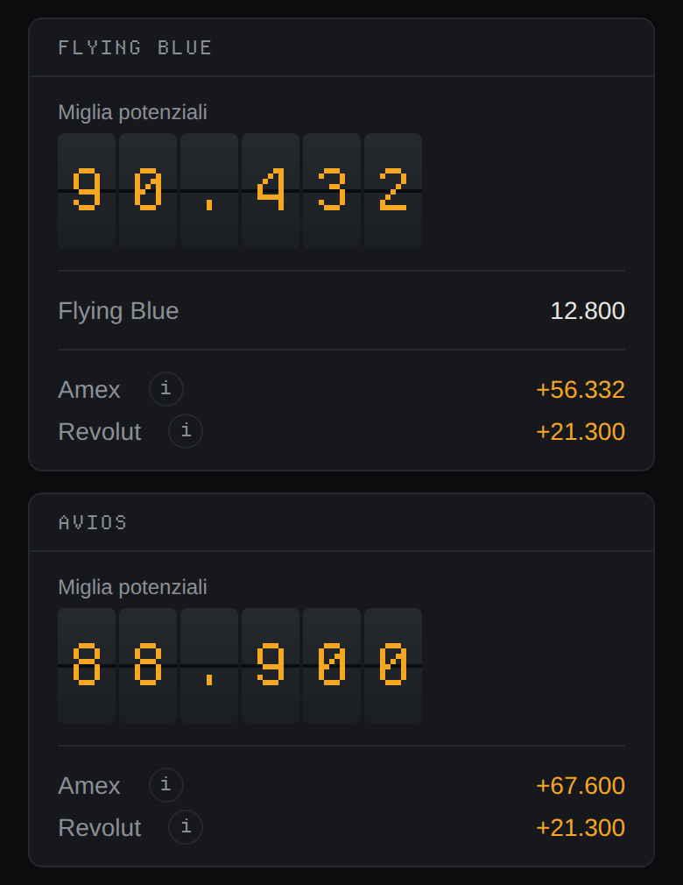

# Yume ✈️

Yume is a private dashboard for reward points and airline miles. The name comes from the
Japanese word 夢. The word means "dream".

## What Yume does

Yume shows all your loyalty balances on one screen:

- flexible points: American Express Membership Rewards and Revolut RevPoints
- airline programmes: 20 programmes, with 15 different point currencies. A source sends
  points to 19 of them.

Yume then calculates the **potential miles**. The potential miles are the miles that you
can have in one airline currency, if you transfer all your flexible points to that
currency.

Yume does not connect to your bank or to your airline account. You write the balances
manually.



## The pages

Yume has three pages:

| Page | Address | Who reads it |
|---|---|---|
| The public page | `/` | Each visitor. It says what Yume calculates and it gives the two limits of that value. |
| The dashboard | `/dashboard` | A user with an account. |
| The access | `/login` | A visitor with an account. |
| The sign-up | `/signup` | A visitor with a link of invitation. |

The application on the home screen of a telephone opens the dashboard.

## Scope

Yume is for the Italian market. It contains only the transfer partners of American
Express Italy and Revolut. Amex Italy and Revolut are the only two sources of flexible
points in Italy.

## Important

The potential miles value is a calculation, not a balance. Two limits apply:

1. The value is a maximum for each currency. You cannot send the same points to two
   different programmes.
2. A transfer of points is permanent. Find the award seat first. Then transfer the
   points.

## Status

The project is in the first stage of the development. The conversion logic, the database,
the API, the public page and the dashboard are present. From the dashboard you add an
account, you write a balance, you cancel a balance and you remove an account. Yume
installs on the home screen of a telephone.

The catalogue holds all the 19 airline programmes that receive points from Amex Italia or
from Revolut. It also holds Miles & More, which no source can increase.

Authentication is present. Registration is possible only with an invitation. The log of
the container gives the link of the first user, and each user then has two invitations.

## Potential future functions

These two functions are not present. A later session can add them.

**The history of the balances.** The database keeps a snapshot of a balance at a date.
The dashboard shows the most recent snapshot only. A later version can show each snapshot
of an account, and the change between two dates.

**Hotel programmes and rail programmes in the catalogue.** These programmes also collect
points, and some of them send those points to an airline programme. The database holds
the two kinds already. Each new transfer rule needs the official page in a comment, and
the user confirms each ratio.

## Installation

Yume runs in one container on a home server, on a NAS or on a Raspberry Pi with arm64.
The installation needs `compose.yaml` and `.env` only. It needs no clone of the
repository, because Docker pulls the image from `ghcr.io/dstmrk/yume`:

```bash
mkdir -p data && sudo chown 1000:1000 data
cp .env.example .env      # then write the values
docker compose up -d
```

The container applies the migrations, writes the catalogue and then starts the server.
The directory `data/` holds the database. That directory stays outside the image.

Then make the first user. The server writes a link in the log while the database holds no
user. Read that link and open it:

```bash
docker compose logs | grep signup
```

The link holds a code of one use. That code dies with the first user, and a new start
with no user gives a new code. Each user then has two invitations, with a code that is
valid for 24 hours. The dashboard writes those invitations.

Yume then listens on `127.0.0.1:3000`. Put TLS in front of that port: Tailscale, a
Cloudflare Tunnel, or Caddy with a local certificate. A browser installs a progressive
web application from an origin with TLS only.

## Documents

- [`docs/architecture.md`](docs/architecture.md) — the stack, the data model and the
  deployment rules
- [`CLAUDE.md`](CLAUDE.md) — the rules for work in this repository

## Language

The user interface is in Italian. All documents are in ASD-STE100 Simplified Technical
English. All code, all identifiers and all commit messages are in English.

---

*Your daily expenses become your next journey.*
